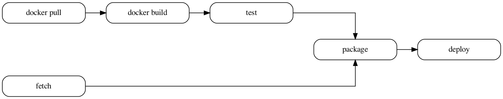

# cloudbuildgraph

[](https://goreportcard.com/report/github.com/patrickhoefler/cloudbuildgraph)
[](https://codeclimate.com/github/patrickhoefler/cloudbuildgraph/maintainability)
[](https://codecov.io/gh/patrickhoefler/cloudbuildgraph)

`cloudbuildgraph` visualizes your Google Cloud Build pipeline.

## Example Output



## Getting Started

### Prerequisites

- A `cloudbuild.yaml`, `cloudbuild.yml` or `cloudbuild.json` [Google Cloud Build config](https://cloud.google.com/cloud-build/docs/build-config) file in your current working directory

### Installation and Usage

Running `cloudbuildgraph` will create a `cloudbuild.pdf` file in your current working directory that contains a visual graph representation of your Cloud Build pipeline.

#### Docker

```shell
docker run \
  --rm \
  --workdir /workspace \
  --mount type=bind,source="$(pwd)",target=/workspace \
  ghcr.io/patrickhoefler/cloudbuildgraph
```

#### Homebrew

```shell
brew install patrickhoefler/tap/cloudbuildgraph
cloudbuildgraph
```

#### Build from Source

```shell
go build
./cloudbuildgraph
```

## License

[MIT](https://github.com/patrickhoefler/cloudbuildgraph/blob/main/LICENSE)
